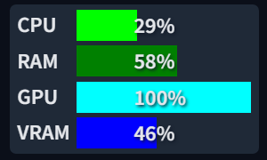

# SD Webui Resource Monitor

This is an Extension for the <a href="https://github.com/AUTOMATIC1111/stable-diffusion-webui">Automatic1111 Webui</a>, which allows you to monitor the resource usage in real-time.

> **Reference:** https://github.com/crystian/ComfyUI-Crystools

> Compatible with [Forge](https://github.com/lllyasviel/stable-diffusion-webui-forge)

> [!IMPORTANT]  
> This only works with **Nvidia** GPU

## Settings

In the `Hardware Monitor` section of the **Settings** tab, you can:

- Set the `GPU ID` to monitor
    - **Default:** `0`
- Change the `Polling Rate` for the refresh
    - **Default:** `1000 ms`

## To Do
- [ ] More configurable entries
